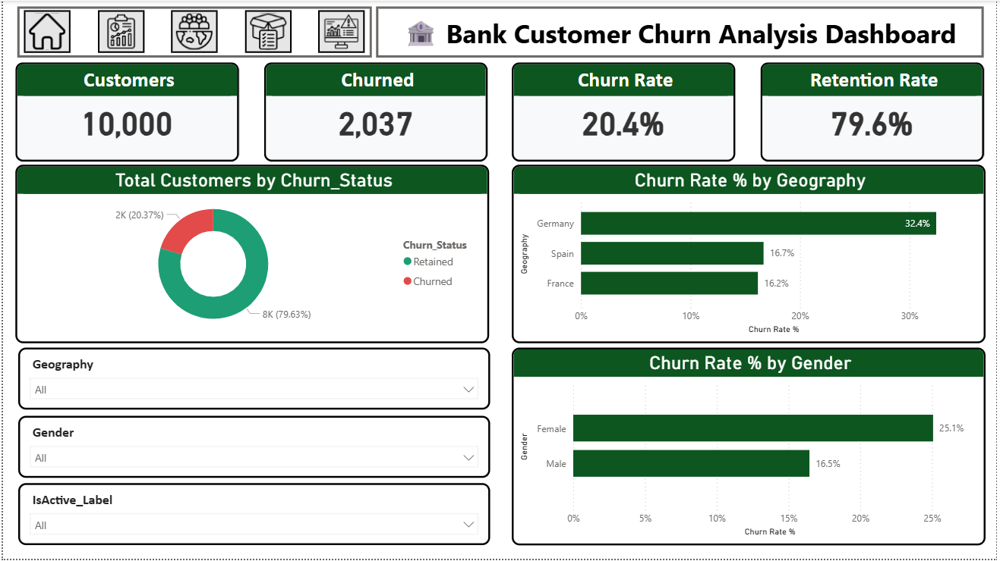

# 🏦 Bank Customer Churn Analysis — Power BI

## 📌 Project Overview
An advanced, interactive Power BI dashboard designed to evaluate, predict, and analyze bank customer churn behavior. This project explores data across 10,000 customers to extract underlying risk patterns based on demographics, geography, account balances, and product engagement to help financial institutions design effective customer retention strategies.

## 🎯 Business Questions Answered
- What are the bank's baseline customer metrics (Total Customers, Churn Rate, and Retention Rate)?
- How does customer geography and gender influence the propensity to churn?
- Which age groups represent the highest flight risk for business continuity?
- How do product usage, credit card ownership, and active account status impact loyalty?

## 🛠️ Tools Used
- **Power BI Desktop**: Advanced DAX calculations, Key Performance Indicators (KPIs), and Data Modeling.
- **Power Query**: Data cleaning, handling missing values, and business logic transformation.
- **Advanced Visuals**: Decomposition Tree (for root-cause risk analysis) and interactive matrices.

## 💡 Key Insights
- **Core KPIs**: Out of **10,000 total customers**, the bank has experienced **2,037** churned profiles, leading to a **20.4% Churn Rate** and a **79.6% Retention Rate**.
- **Geographic Risk**: **Germany** shows a severe churn rate of **32.4%**, which is nearly double that of Spain (16.7%) and France (16.2%).
- **Demographic Vulnerability**: The **50–59 age group** is exceptionally vulnerable, exhibiting a staggering **56.0% churn rate**. Furthermore, **Female customers** display a higher churn rate (**25.1%**) compared to males (**16.5%**).
- **Product & Engagement Deficit**: Customers holding **3 or 4 products** have an alarming churn rate of **85.9%** (with 4 products hitting **100%** churn). Additionally, **Inactive users** possess a higher churn rate (**26.9%**) than active ones (**14.3%**).

## 📁 Files
- `Bank Customer Churn Analysis.pbix`: Core Power BI dashboard file containing advanced models and visuals
- `dashboard_preview.png`: Core system analysis summary screenshot

## 📷 Dashboard Preview

## 🔗 Connect with Me
[LinkedIn](https://linkedin.com)
